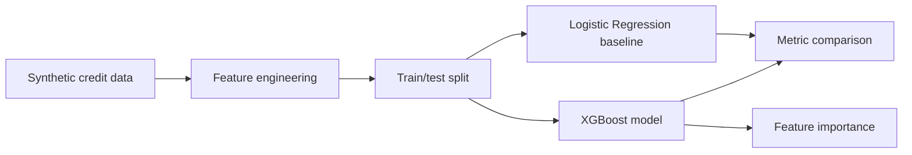

# loan-default-xgboost

## Português

`loan-default-xgboost` é um projeto de classificação binária para predição de inadimplência, com `XGBoost` como modelo principal e `Logistic Regression` como baseline comparativo.


### Objetivo técnico

O foco é mostrar um caso forte de ML tabular com:

- feature engineering orientada a risco de crédito;
- baseline linear para comparação;
- `XGBoost` como modelo principal;
- métricas adequadas para classificação binária;
- inspeção de importância de atributos.

### Topologia do projeto

- [src/data_factory.py](src/data_factory.py)
  Gera um dataset sintético reproduzível com semântica de risco de crédito.
- [src/modeling.py](src/modeling.py)
  Executa o split de dados, treina baseline e modelo principal, calcula métricas e gera importâncias.
- [main.py](main.py)
  Entry point do projeto, responsável por persistir o relatório consolidado.
- [tests/test_project.py](tests/test_project.py)
  Valida a integridade do pipeline e a qualidade mínima do resultado.

### Modo de execução

O projeto prefere `XGBoost` quando a biblioteca está disponível no ambiente. Se `xgboost` não estiver instalado, o pipeline entra automaticamente em um fallback reproduzível com `HistGradientBoostingClassifier`, mantendo:

- execução local sem bloqueio;
- comparação contra baseline linear;
- ranking de importância por permutação.

### Estratégia de modelagem

O pipeline foi montado com três camadas:

1. `Baseline linear`
   `Logistic Regression` com `class_weight="balanced"` para estabelecer um referencial simples e interpretável.
2. `Modelo principal`
   `XGBoost`, quando disponível, para capturar interações não lineares e obter melhor ordenação do risco.
3. `Fallback reproduzível`
   `HistGradientBoostingClassifier`, usado quando `xgboost` não está instalado no ambiente.

Essa estrutura é útil porque evita dois extremos:

- depender apenas de um baseline fraco;
- bloquear a execução local por causa de uma dependência ausente.

### Stack

- `pandas`
- `numpy`
- `scikit-learn`
- `xgboost`
- `unittest`

### Pipeline



### Semântica das métricas

As métricas escolhidas refletem objetivos diferentes do problema:

- `ROC-AUC`
  Mede a capacidade de ordenação global entre bons e maus pagadores.
- `Average Precision`
  Dá uma leitura mais sensível à classe positiva, importante quando default é minoritário.
- `Precision`
  Indica quão “limpas” são as sinalizações de risco.
- `Recall`
  Mede cobertura sobre a classe de inadimplência.
- `F1`
  Resume o trade-off entre `precision` e `recall`.

Em um caso de underwriting, a leitura isolada de uma única métrica tende a ser insuficiente. Por isso o projeto preserva um bloco completo de avaliação para o baseline e para o modelo selecionado.

### Variáveis do dataset

O dataset sintético inclui sinais como:

- estabilidade de renda
- razão dívida/renda
- utilização de crédito
- atraso recente
- histórico de crédito
- volatilidade de caixa
- burden de parcelas
- interação entre utilização e delinquência

### Contrato do artefato

O relatório consolidado contém:

- `project_name`
- `dataset_rows`
- `positive_rate`
- `runtime_mode`
- `baseline_model`
- `baseline_metrics`
- `selected_model`
- `selected_model_metrics`
- `top_feature_importance`

Isso permite usar o projeto tanto como benchmark local quanto como bloco de partida para evoluções com serving, monitoramento e explicabilidade mais avançada.

### Resultados atuais

- `dataset_rows = 1800`
- `positive_rate = 0.2611`
- `runtime_mode = fallback_without_xgboost`

#### Baseline

- `model = logistic_regression`
- `roc_auc = 0.8676`
- `average_precision = 0.7680`
- `precision = 0.4949`
- `recall = 0.8376`
- `f1 = 0.6222`

#### Modelo selecionado no runtime atual

- `model = hist_gradient_boosting_fallback`
- `roc_auc = 0.9541`
- `average_precision = 0.9112`
- `precision = 0.9043`
- `recall = 0.7265`
- `f1 = 0.8057`

#### Principais variáveis pelo ranking atual

- `credit_history_length`
- `employment_consistency`
- `credit_utilization`
- `application_velocity`
- `hard_inquiries`
- `cash_flow_volatility`
- `behavior_score`
- `asset_buffer`

### Artefato gerado

- `data/processed/loan_default_xgboost_report.json`

Esse arquivo é gerado em runtime e não é versionado.

### Execução

```bash
python3 main.py
python3 -m unittest discover -s tests -v
python3 -m py_compile main.py src/data_factory.py src/modeling.py
```

## English

`loan-default-xgboost` is a binary classification project for default prediction, using `XGBoost` as the primary model and `Logistic Regression` as a baseline.

When `xgboost` is not available in the runtime, the project automatically falls back to `HistGradientBoostingClassifier` so the pipeline remains executable and testable locally.


### Project topology

- [src/data_factory.py](src/data_factory.py)
  Deterministic synthetic credit dataset generation.
- [src/modeling.py](src/modeling.py)
  Modeling, evaluation, and feature-importance generation.
- [main.py](main.py)
  Consolidated entry point and runtime artifact writer.
- [tests/test_project.py](tests/test_project.py)
  Pipeline regression checks.

### Metric semantics

- `ROC-AUC`
  Global ranking quality across classes.
- `Average Precision`
  Positive-class sensitivity under class imbalance.
- `Precision`
  Signal cleanliness for predicted defaults.
- `Recall`
  Coverage over the default class.
- `F1`
  Precision/recall balance.

### Current results

- `dataset_rows = 1800`
- `positive_rate = 0.2611`
- `runtime_mode = fallback_without_xgboost`

#### Baseline

- `model = logistic_regression`
- `roc_auc = 0.8676`
- `average_precision = 0.7680`
- `precision = 0.4949`
- `recall = 0.8376`
- `f1 = 0.6222`

#### Runtime-selected model

- `model = hist_gradient_boosting_fallback`
- `roc_auc = 0.9541`
- `average_precision = 0.9112`
- `precision = 0.9043`
- `recall = 0.7265`
- `f1 = 0.8057`
