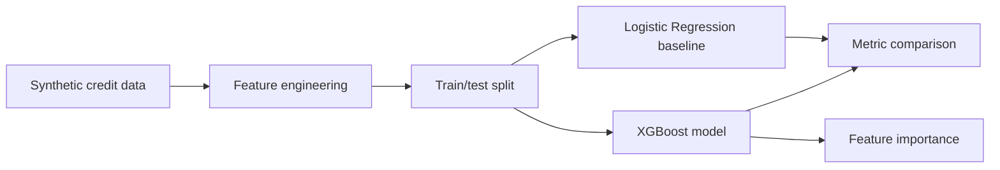

# loan-default-xgboost

## Português

`loan-default-xgboost` é um projeto de classificação binária para predição de inadimplência, com `XGBoost` como modelo principal e `Logistic Regression` como baseline comparativo.

### Objetivo técnico

O foco é mostrar um caso forte de ML tabular com:

- feature engineering orientada a risco de crédito;
- baseline linear para comparação;
- `XGBoost` como modelo principal;
- métricas adequadas para classificação binária;
- inspeção de importância de atributos.

### Modo de execução

O projeto prefere `XGBoost` quando a biblioteca está disponível no ambiente. Se `xgboost` não estiver instalado, o pipeline entra automaticamente em um fallback reproduzível com `HistGradientBoostingClassifier`, mantendo:

- execução local sem bloqueio;
- comparação contra baseline linear;
- ranking de importância por permutação.

### Stack

- `pandas`
- `numpy`
- `scikit-learn`
- `xgboost`
- `unittest`

### Pipeline



### Variáveis do dataset

O dataset sintético inclui sinais como:

- estabilidade de renda
- razão dívida/renda
- utilização de crédito
- atraso recente
- histórico de crédito
- volatilidade de caixa
- burden de parcelas
- interação entre utilização e delinquência

### Artefato gerado

- `data/processed/loan_default_xgboost_report.json`

Esse arquivo é gerado em runtime e não é versionado.

### Execução

```bash
python3 main.py
python3 -m unittest discover -s tests -v
python3 -m py_compile main.py src/data_factory.py src/modeling.py
```

## English

`loan-default-xgboost` is a binary classification project for default prediction, using `XGBoost` as the primary model and `Logistic Regression` as a baseline.

When `xgboost` is not available in the runtime, the project automatically falls back to `HistGradientBoostingClassifier` so the pipeline remains executable and testable locally.
